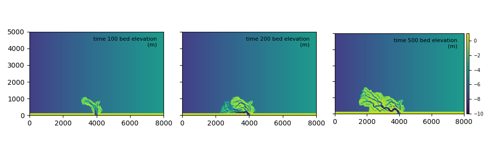

**********
User Guide
**********

Guide to users!

==============================
Configuring an input YAML file
==============================

The configuration for a pyDeltaRCM run is set up by a parameter set, described in the ``YAML`` markup format.
To configure a run, you should create a file called, for example, ``run_parameters.yml``. 
Inside this file you can specify parameters for your run, with each parameter on a new line. For example, if ``run_parameters.yml`` contained the line: 

.. code-block:: yaml

    S0: 0.005
    seed: 42

then a :obj:`~pyDeltaRCM.DeltaModel` model instance initialized with this file specified as ``input_file`` will have a slope of 0.005, and will use a random seed of 42.
Multiple parameters can be specified line by line.

Default values are substituted for any parameter not explicitly given in the ``input_file`` ``.yml`` file.
Default values of the YAML configuration are listed in the :doc:`../reference/model/yaml_defaults`.

===================
Starting model runs
===================

There are two API levels at which you can interact with the pyDeltaRCM model.
There is a "high-level" model API, which takes as argument a YAML configuration file, and will compose a list of jobs as indicated in the YAML file; the setup can be configured to automatically execute the job list, as well.
The "low-level" API consists of creating a model instance from a YAML configuration file and manually handling the timestepping, or optionally, augmenting operations of the model to implement new features.

High-level model API
====================

The high-level API is accessed via either a shell prompt or python script, and is invoked directly if a YAML configuration file includes the ``timesteps`` variable.

For the following high-level API demonstrations, consider a YAML input file named ``model_configuration.yml`` which looks like:

.. code-block:: yaml

    Length: 5000
    Width: 2000
    timesteps: 500

Command line API
----------------

To invoke a model run from the command line using the YAML file ``model_configuration.yml`` defined above, 
we would simply call:

.. code:: bash
    
    pyDeltaRCM --config model_configuration.yml

or equivalently:

.. code:: bash
    
    python -m pyDeltaRCM --config model_configuration.yml

These invokations will run the pyDeltaRCM :obj:`preprocessor <pyDeltaRCM.preprocessor.PreprocessorCLI>` with the parameters specified in the ``model_configuration.yml`` file. 
If the YAML configuration indicates multiple jobs (:ref:`via matrix expansion or ensemble specification <configuring_multiple_jobs>`), the jobs will each be run automatically by calling :obj:`~pyDeltaRCM.DeltaModel.update` on the model 500 times.

Python API
----------

The Python high-level API is accessed via the :obj:`~pyDeltaRCM.Preprocessor` object. 
First, the `Preprocessor` is instantiated with a YAML configuration file (e.g., ``model_configuration.yml``):

.. code::

    >>> pp = preprocessor.Preprocessor(p)
    
which returns an object containing the list of jobs to run. 
Jobs are then run with:

.. code::

    >>> pp.run_jobs()

Low-level model API
===================

iinteract with the model by creating your own script, and manipulating model outputs at the desired level. The simplest case is to do

.. code::

    >>> delta = DeltaModel(input_file='model_configuration.yml')

    >>> for _ in range(0, 1):
    ...    delta.update()

    >>> delta.finalize()

However, you can also inspect/modify the :obj:`~pyDeltaRCM.DeltaModel.update` method, and change the order of operations, or add operations, as desired.

=============================
Advanced model configurations
=============================

.. _configuring_multiple_jobs:

Configuring multiple model runs from a single YAML file
==============================================================

Multiple model runs (referred to as "jobs") can be configured by a single `.yml` configuration file, by using the `matrix` and `ensemble` configuration keys.

Matrix expansion
----------------

To use matrix expansion to configure multiple model runs, the dimensions of the matrix (i.e., the variables you want to run) should be listed below the `matrix` key. For example, the following configuration is a one-dimensional matrix with the variable `f_bedload`:

.. code:: yaml

    out_dir: 'out_dir'
    dx: 2.0
    h0: 1.0

    matrix:
      f_bedload: 
        - 0.5
        - 0.2

This configuation would produce two model runs, one with bedload fraction (`f_bedload`) 0.5 and another with bedload fraction 0.2, and both with grid spacing (`dx`) 2.0 and basin depth (`h0`) 1.0.
The matrix expansions will create two folders at `./out_dir/job_000` and `./out_dir/job_001` that each correspond to a created job.
Each folder will contain a copy of the configuration file used for that job; for example, the full configuration for `job_000` is:

.. code:: yaml

    out_dir: 'out_dir/job_000'
    dx: 2.0
    h0: 1.0
    f_bedload: 0.5

Additionally, a log file for each job is located in the output folder, and any output grid files or images specified by the input configuration will be located in the respective job output folder.

.. note:: You must specify the `out_dir` key in the input YAML configuation to use matrix expansion.

Multiple dimensional matrix expansion is additionally supported. For example, the following configuation produces six jobs:

.. code:: yaml
    
    out_dir: 'out_dir'

    matrix:
      f_bedload: 
        - 0.5
        - 0.4
        - 0.2
      h0:
        - 1
        - 5

Ensemble expansion
------------------

todo

================================
Customizing the model operations
================================

.. _customize_the_model:

The :obj:`~pyDeltaRCM.DeltaModel` is designed for flexibility and extension by users, and to support arbitrary and imaginative changes to the model routine.
For example, one could easily extend the model to include additional delta controls (such as vegetation or permafrost development), or modify the model domain boundary conditions (such as imposing a sloped receiving basin).
This flexibility is achieved by "subclassing" the `DeltaModel` to create a custom model object, and using "hooks" in the model to achieve the desired modifications.

Subclassing is a standard concept in object-oriented programming, whereby a `subclass` obtains all the functionality of the `parent` object, and then adds/modifies existing functionality of the parent, to create a new class of object (i.e., the `subclass`).
To subclass the :obj:`~pyDeltaRCM.model.DeltaModel` we simply create a new Python object class, which inherits from the model class:

.. doctest::
    
    >>> import numpy as np
    >>> import matplotlib.pyplot as plt
    >>> import pyDeltaRCM

    >>> class SubclassDeltaModel(pyDeltaRCM.DeltaModel):
    ...     def __init__(self, input_file=None):
    ...
    ...         # inherit base DeltaModel methods
    ...         super().__init__(input_file)

We then can initialize our new model type, and see that this model has all of the attributes and functionality of the original `DeltaModel`, but its type is our subclass.

.. doctest::

    >>> mdl = SubclassDeltaModel()
    
    # for example, the `mdl` has the `update` method
    >>> hasattr(mdl, 'update')
    True

    >>> mdl
    <SubclassDeltaModel object at 0x...>
    

Hooks are methods in the model sequence that, do nothing by default, but can be augmented to provide arbitrary desired behavior in the model.
Hooks have been integrated throughout the model initialization and update sequences, to allow the users to achieve complex behavior at various times in the default model sequence.
For example, ``after_init()`` is a hook which occurs after the default model initiazization is complete.
To utilize the hooks, we simply define a method in our subclass with the name corresponding to the hook we want to augment to achieve the desired behavior.

So, as an example we don't recommend trying out, change the number of steps a water or sediment parcel could take by changing the model definition from above:

.. doctest::

    >>> class TenStepDeltaModel(pyDeltaRCM.DeltaModel):
    ...     def __init__(self, input_file=None):
    ...
    ...         # inherit base DeltaModel methods
    ...         super().__init__(input_file)
    ...
    ...     def after_init(self):
    ...
    ...         # default is (2 x (L + W))
    ...         self.itmax = 10  # always 10

Now, during the initializing of a `TenStepDeltaModel` instance, our implementation of `after_init()` will be called and `self.itmax` will be adjusted accordingly. 

.. doctest::

    >>> mdl = TenStepDeltaModel()
    >>> mdl.itmax
    10

A complete list of hooks in the model follows:

.. csv-table:: Available model hooks
   :header: "Initializing", "Updating", "Finalizing"
   :widths: 20, 30, 20

   :obj:`~pyDeltaRCM.init_tools.init_tools.after_init`, ~, ~
   ~, ~, ~
   ~, ~, ~

Subclass example 
----------------

Consider the case where we are a researcher seeking to explore the effects of a receiving basin that is sloped perpendicular to the channel outlet. 
This researcher asks: does this sloped basin cause channels to steer towards the deeper water, where compensation is higher?

We can easily use subclassing and the model hooks to achieve our desired effect.

.. doctest:: 

    >>> class SlightSlopeModel(pyDeltaRCM.DeltaModel):
    ...    def __init__(self, input_file):
    ...        super().__init__(input_file)
    ...
    ...    def after_init(self):
    ...        """Called at end of initialize."""
    ...        _slope = 0.0005
    ...        lin = _slope * np.arange(0, self.Width, step=self.dx)
    ...        grid = np.tile(lin, (self.L - self.L0, 1)) - ((_slope*self.Width)/2)
    ...        self.eta[self.L0:, :] = self.eta[self.L0:, :] + grid

    
Coupling this custom model subclass with the :doc:`misc/slight_slope` model configuration file, the `bed_elevation` at the start of the model run reflects our modification to create a sloped receiving basin.

.. code:: python

    >>> mdl = SlightSlopeModel('slight_slope.yml')

.. plot:: userguide/slight_slope.py

and after 500 timesteps, the model has evolved to the bed elevation below. 

While this is not a robust scientific study, this simple modification seems to support the notion that the channels are steered towards deeper water where there is higher accomodation.

Supporting documentation and files
==================================

.. toctree::
   :maxdepth: 2

   misc/slight_slope
